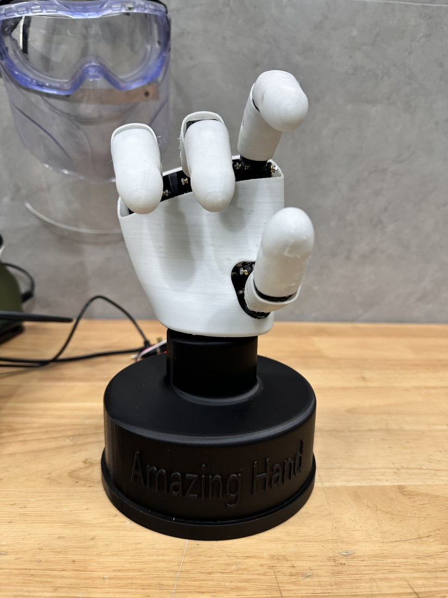
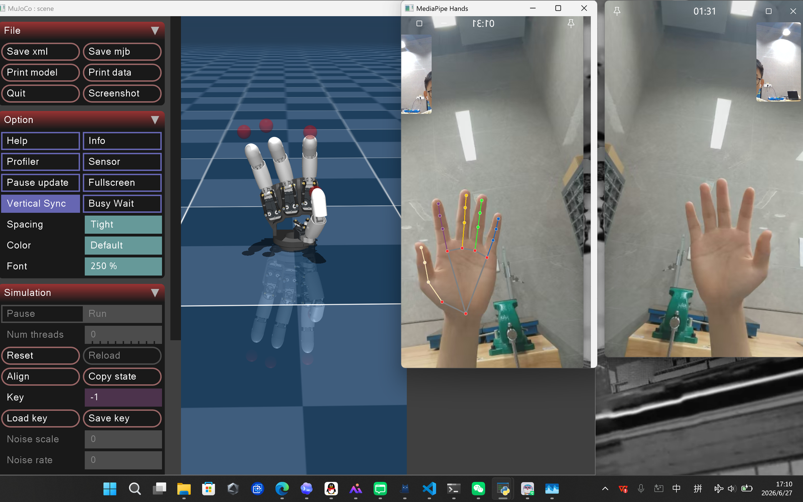

# AmazingHand Vision Control

基于 [Pollen Robotics AmazingHand](https://github.com/pollen-robotics/AmazingHand) 的摄像头手势跟踪与实体机械手控制扩展。

本项目使用 MediaPipe 从普通摄像头估计四指的屈伸和侧摆，将动作映射到 8 个 Feetech SCS0009 总线舵机，并针对遮挡误识别、突然张手、半弯曲保持和单指侧摆做了稳定性优化。



## 主要特性

- 8 自由度实体机械手实时跟踪
- 中立位标定与每指侧摆增益/偏置
- 弯曲锁定和时间滤波，降低遮挡引起的误展开
- 安全调零、全手开合循环与串口诊断
- 仅保留报告对应的最终稳定控制版本
- 完整项目报告与关键实验结果

## 目录

```text
src/          最终手势跟踪控制脚本
tools/        安全调零和硬件检查工具
docs/         项目报告和关键图片
```

## 环境要求

- Windows 10/11
- Python 3.10–3.12
- 普通 USB 摄像头
- Waveshare BUS SERVO ADAPTER (A) 或兼容串口总线适配器
- 8 × Feetech SCS0009，总线 ID 为 1–8
- 已完成装配与机械零位检查的 AmazingHand

先从上游项目获取机械结构、装配说明和基础控制资料：

```powershell
git clone https://github.com/pollen-robotics/AmazingHand.git
```

## 快速开始

```powershell
py -3.12 -m venv .venv
.\.venv\Scripts\Activate.ps1
python -m pip install --upgrade pip
python -m pip install -r requirements.txt
```

默认串口是 `COM3`，可通过环境变量修改，不需要改源码：

```powershell
$env:AMAZINGHAND_SERIAL_PORT = "COM11"
$env:AMAZINGHAND_CAMERA_INDEX = "0"
python .\src\AmazingHand_HandTrack_FINAL_STABLE.py
```

只测试视觉识别、不连接实体机械手：

```powershell
$env:AMAZINGHAND_SIMULATE_ONLY = "1"
python .\src\AmazingHand_HandTrack_FINAL_STABLE.py
```

运行时按键：

| 按键 | 功能 |
| --- | --- |
| `n` | 把当前自然张手姿势记录为侧摆中立位 |
| `r` | 清除侧摆中立位标定 |
| `Space` | 手动张开 |
| `c` | 手动闭合 |
| `q` | 退出 |

## 推荐调试顺序

1. 断开机械负载或把手放在电源开关旁，确认所有舵机 ID 和线序。
2. 设置正确串口，运行 `python .\tools\zero_fine_tune.py`。
3. 逐项确认零位、最大伸展和最大收缩不会发生机械顶死。
4. 设置 `AMAZINGHAND_SIMULATE_ONLY=1`，确认摄像头识别和界面正常。
5. 清除该变量后运行最终控制程序；自然张手并按 `n` 完成侧摆标定。
6. 根据自己的机械手修改脚本顶部的 `MIDDLE_POS_DEG`、角度限位、增益和偏置。

## 核心控制程序

`src/AmazingHand_HandTrack_FINAL_STABLE.py` 是项目报告对应的唯一控制版本，也是本项目软件部分的主要独立成果。它包含中立位标定、逐指屈伸与侧摆映射、弯曲锁定、侧摆衰减和时间滤波。



## 安全提示

实体舵机可能突然动作。首次运行必须低速、空载测试，并确保可立即断电。不要在机械手运动范围内放置手指、线缆或易碎物品。每台机械手的零位和可动范围不同，仓库中的参数只是本项目样机标定结果，不能直接视为通用安全值。

## 项目资料

- [项目总结报告](docs/AmazingHand_Final_Report.pdf)
- [上游装配、CAD 与基础示例](https://github.com/pollen-robotics/AmazingHand)

## 许可证与致谢

本项目基于 Pollen Robotics 的 AmazingHand 开源工作。代码分发遵循仓库中的 Apache License 2.0；上游机械设计采用 CC BY 4.0。具体归属说明见 [NOTICE.md](NOTICE.md)。
